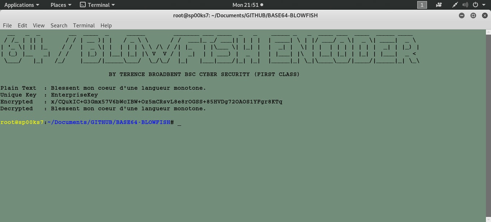

# BASE64/BLOWFISH ENCODER
## A SIMPLE PYTHON SCRIPT FILE TO CREATE AND READ BASE64/BLOWFISH ENCODED TEXT STRINGS USING A CORPORATE ENTERPRISE KEY.

Usage: python base64_blowfish.py

| LANGUAGE | FILENAME           | MD5 HASH                         |
|------    |------              | -------                          |
| python   | base64_blowfish.py | 6f63162dc5494a1abcbb33709d846f78 |

### CONSOLE DISPLAY

